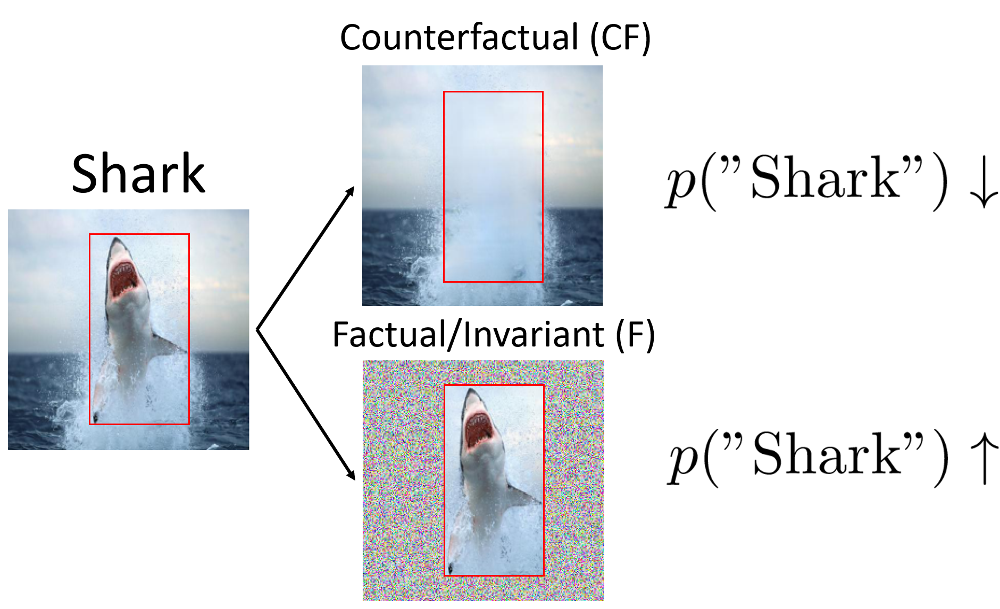

# Towards Robust Classification Model by Counterfactual and Invaraint Generation (CVPR 2021) 

This repository is the official implementation of [our CVPR 2021 paper](https://arxiv.org/abs/2106.01127). 



## Requirements

### Code packages

We use the following packages:
- python 3.6.8
- pytorch 1.6
- pytorch_lightning 1.2.8
- pandas 1.1.5
- numpy 1.19.2
- scikit-learn 0.22.1
- captum

To install requirements:
```setup
pip install -r requirements.txt
```

### 📋 Download datasets

We provide 3 shell scripts under datasets/ that download the datasets. 
We also provide our counterfactual inpainting images imputed by CAGAN.
To run:
```setup
cd datasets/
bash fetch_in9.sh
bash fetch_wb.sh
bash fetch_cct.sh
```

## Training

Arguments:
- dataset: which dataset to run. Chose from ['in9', 'wb', 'cct', 'in9l'] (wb means waterbird, and in9l is the larger set of in9). Remember to download datasets first. 
- inpaint: which counterfactual augmentation to use. Chose from ['none', 'mean', 'random', 'shuffle', 'tile', 'cagan']. We find the cagan or tile perform the best.
- f_inpaint: which factual augmentation to use.  Chose from ['none', 'random', 'shuffle', 'fgsm']. 
- reg: if use saliency regularization. Chose from ['none', 'bbox_o']. If set to 'bbox_o', it penalizes the L2 norm of gradients outside of bounding box.
- reg_grad: which saliency type to penalize. Default: 'grad_y'. We implemented various ways including GradCAM and DeepLift, but we find penalizing the simple input gradient is the best. We find the original loss from Right for the Right Reason perform poorly and thus only penalize raw gradients norm.
- reg_coeff: the penalty lambda used in saliency regularization.
- seed: random seed. In our experiments we set seed to 5, 10, 100.
- fp16: if set to 1, it uses fp16 training to speed up. When training saliency regularization (Sal), fp16 usually crashes and is recommended to set it to 0. 

For example, if we want to run a CF(CAGAN) + F(Shuffle) + Sal(lambda=10) in Waterbird. We can run:
```train
dataset='wb'
seed='5'
inpaint='cagan'
f_inpaint='shuffle'
reg='bbox_o'
reg_coeff='10'
python3 -u train_pl.py --name 0219_${dataset}_${inpaint}_f${f_inpaint}_${reg}_reg${reg_coeff}_s${seed} --dataset ${dataset} --fp16 1 --seed ${seed} --inpaint ${inpaint} --f_inpaint ${f_inpaint} --reg ${reg} --reg_coeff ${reg_coeff}
```

If encounter error, increase the batch_split or turn off fp16.
The models will be stored in `lightning_logs/$name/`. 
And the results including test/val error are stored in `results/WaterbirdLightningModel_results.tsv`.
Use notebook and pandas to read it.
```read
import pandas as pd
pd.read_csv('results/WaterbirdLightningModel_results.tsv', delimiter='\t')
```

## Other experiments
We tried several datasets that we find neither our method nor our Sal baseline improve, but just list them here for references:
1. [ImageNet-A dataset](https://arxiv.org/abs/1907.07174): in this paper they show some of their examples have some background confounding, but in our experiments all methods perform the same.
2. [ObjectNet](https://objectnet.dev/): similar to ImageNet-A but does not have clear background spuriousness.
3. [Xray with different view points](https://openreview.net/forum?id=SJx0PAEFDS): it is shown in recent ICLR paper that Sal can improve on this Xray datasets when different view points are correlated with labels. We do not find any improvement for all baselines and our methods.


## Citation

If you find this code helpful, please cite
```citations
@article{chang2021towards,
  title={Towards Robust Classification Model by Counterfactual and Invariant Data Generation},
  author={Chang, Chun-Hao and Adam, George Alexandru and Goldenberg, Anna},
  journal={arXiv preprint arXiv:2106.01127},
  year={2021}
}
```


## Contributing

All content in this repository is licensed under the Apache license.


